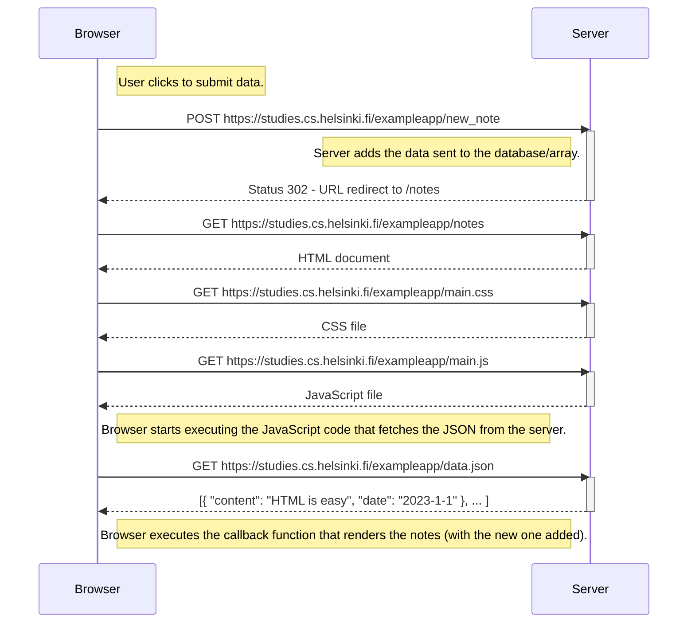

# Exercise 0.4: New Note Diagram

The sequence diagram below shows what happens when the user creates a new note on the page https://studies.cs.helsinki.fi/exampleapp/notes.

```mermaid
sequenceDiagram
    participant Browser
    participant Server

    Note right of Browser: User clicks to submit data.

    Browser->>Server: POST https://studies.cs.helsinki.fi/exampleapp/new_note
    activate Server
    Note left of Server: Server adds the data sent to the database/array.
    Server-->>Browser: Status 302 - URL redirect to /notes
    deactivate Server

    Browser->>Server: GET https://studies.cs.helsinki.fi/exampleapp/notes
    activate Server
    Server-->>Browser: HTML document
    deactivate Server

    Browser->>Server: GET https://studies.cs.helsinki.fi/exampleapp/main.css
    activate Server
    Server-->>Browser: CSS file
    deactivate Server

    Browser->>Server: GET https://studies.cs.helsinki.fi/exampleapp/main.js
    activate Server
    Server-->>Browser: JavaScript file
    deactivate Server

    Note right of Browser: Browser starts executing the JavaScript code that fetches the JSON from the server.

    Browser->>Server: GET https://studies.cs.helsinki.fi/exampleapp/data.json
    activate Server
    Server-->>Browser: [{ "content": "HTML is easy", "date": "2023-1-1" }, ... ]
    deactivate Server

    Note right of Browser: Browser executes the callback function that renders the notes (with the new one added).
```
