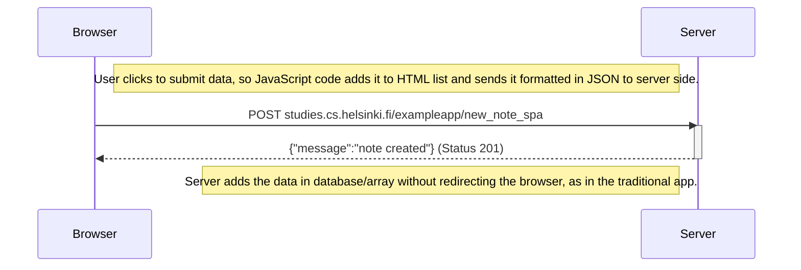

# Exercise 0.6: New note in Single page app diagram

The sequence diagram below shows what happens when the user creates a new note in https://studies.cs.helsinki.fi/exampleapp/spa.

```mermaid
sequenceDiagram
    participant Browser
    participant Server

    Note right of Browser: User clicks to submit data, so JavaScript code adds it to HTML list and sends it formatted in JSON to server side.

    Browser->>Server: POST studies.cs.helsinki.fi/exampleapp/new_note_spa
    activate Server
    Server-->>Browser: {"message":"note created"} (Status 201)
    deactivate Server

    Note left of Server: Server adds the data in database/array without redirecting the browser, as in the traditional app.
```
